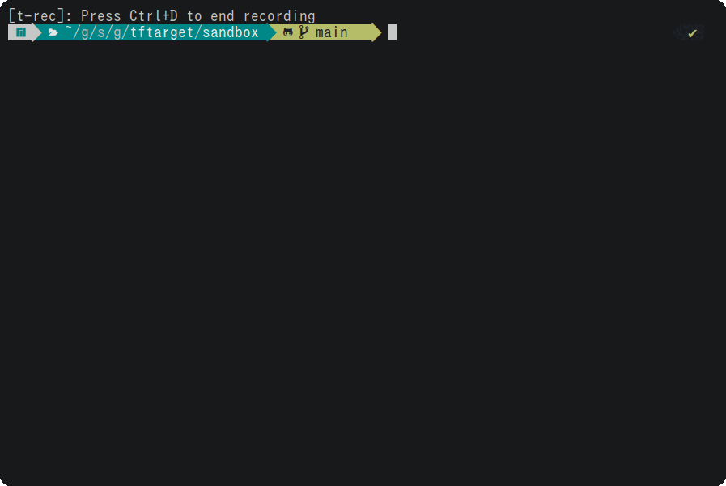

# tftarget
[](https://opensource.org/licenses/MIT)
[](https://pkg.go.dev/github.com/orangekame3/tftarget)
[](https://github.com/orangekame3/tftarget/actions/workflows/release.yml)
[](https://github.com/orangekame3/tftarget/actions/workflows/tagpr.yml)

A Terraform plan/apply target tool

## Features
You can interactivity select resource to plan/appply with target option. 


## tftarget plan


## tftarget apply


## Requirements
The tftarget invokes the Terraform command, so Terraform must be installed on the local environment.

## Getting Started
We have prepared a sandbox environment where Terraform can be run in a Docker environment, so please clone the repository and try it out.

```shell
git clone https://github.com/orangekame3/tftarget.git
```

Please navigate to the 'sandbox' directory.

```shell
cd tftarget/sandbox
```


Please run the compose.yml file.

```shell
docker compose -f compose.yml up -d localstack
```

Now that localstack has started, you should be able to run Terraform.  
Please run the following command to confirm that Terraform is functioning properly.

```
terraform init
terraform plan
```

Once you have reached this point, the preparation is complete.

## Install

### GO

```shell
go install github.com/orangekame3/tftarget@latest
```

### Download

Download the latest compiled binaries and put it anywhere in your executable path.

https://github.com/orangekame3/tftarget/releases

## Usage

```
tftarget --help                                                          ✔
A longer description that spans multiple lines and likely contains
examples and usage of using your application. For example:

Cobra is a CLI library for Go that empowers applications.
This application is a tool to generate the needed files
to quickly create a Cobra application.

Usage:
  tftarget [command]

Available Commands:
  apply       Create a Terraform apply
  completion  Generate the autocompletion script for the specified shell
  help        Help about any command
  plan        Create a Terraform plan

Flags:
  -h, --help      help for tftarget
  -t, --toggle    Help message for toggle
  -v, --version   version for tftarget

Use "tftarget [command] --help" for more information about a command.
```


